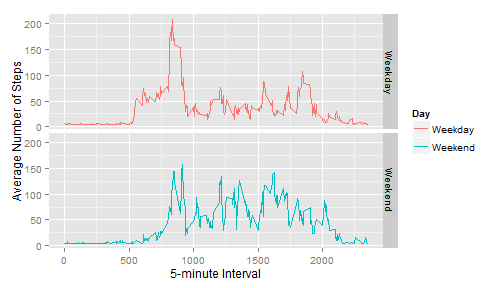

---
html_document:
    keep_md: true
author: "Stefanoman"
date: "December 19, 2015"
output: 
  html_document: 
    fig_caption: yes
title: "Reproducible Research: Peer Assessment 1"
---

This is the R Markdown document for the Reproducible Research Peer Assessment Project #1.  The following is the code and results to answer the following assigned questions:

library(ggplot2)  
library(Hmisc)  
library(lattice)  

## Loading and preprocessing the data
This chunk assumes the "activity" file is in the working directory  


```r
# set numeric display options, then read in csv file
options(scipen = 1, digits = 2)
activity <- read.csv("activity.csv")
```

## What is mean total number of steps taken per day?

```r
    # Break out the steps by Day...
    stepsDate <- tapply(activity$steps, activity$date, sum, na.rm=TRUE)
```

### Histogram of Steps per Day

```r
    hist(stepsDate,col="red",breaks=10,main="Histogram of Steps By Day", xlab="Steps by Day", ylab="Frequency of Occurence")
```

 

### Calculate the Mean and Median of the Total Steps per Day

```r
    meanSteps <- mean(stepsDate)
    medianSteps <- median(stepsDate)
```
**The MEAN Steps per Day is 9354.23 and the MEDIAN Steps per Day is 10395.**

## What is the average daily activity pattern?


```r
    # Need to find the average for each 5 min. time interval across all days
    IntervalMean<- aggregate(steps ~ interval,activity,mean)
    head(IntervalMean)
```

```
##   interval steps
## 1        0 1.717
## 2        5 0.340
## 3       10 0.132
## 4       15 0.151
## 5       20 0.075
## 6       25 2.094
```

  
### Plot the Average Steps per Interval and find the Interval with the HIGHEST MEAN STEPS

```r
    # Find max interval steps on average, then plot the interval mean values
    MAXInt <- IntervalMean[IntervalMean$steps==max(IntervalMean$steps),]
    plot(IntervalMean$interval,IntervalMean$steps, "l",xlab="5-Minute Interval", ylab="Average Steps")
```

 

**The Interval with the highest AVERAGE number of steps across all days is INTERVAL 835 with an AVERAGE STEP COUNT of 206.17.**


## Imputing missing values and fill them in to create a new dataset
**The strategy for imputing missing values is to replace NA values with the MEAN interval value**


```r
    #  Find the missing rows and count them
   missing <- nrow(activity)-nrow(activity[complete.cases(activity),])
      #  Impute values into rows with "NA" step entries
   #  Choose to insert the interval MEAN where NAs are found
   # Create a new dataset with Imputed data
   imputedactivity <- activity
   #imputedactivity$steps <- impute(activity$steps,fun=mean)
   cc <- complete.cases(activity)
   meansteps <- mean(activity$steps[cc])
   x <- is.na(imputedactivity)
   imputedactivity[x] <- meansteps
```

**The number of missing values (NAs) in the source dataset is 2304.**


#### Revised Histogram and Statistics for Imputed Data

```r
    stepsImputed <- tapply(imputedactivity$steps, imputedactivity$date, sum, na.rm=TRUE)
    hist(stepsImputed,col="red",breaks=10,main="Histogram of Imputed Steps By Day", xlab="Steps by Day (Imputed)", ylab = "Frequency of Occurence")
```

 

### Calculate the Mean and Median of the Total Steps per Day

```r
    meanStepsI <- mean(stepsImputed)
    medianStepsI <- median(stepsImputed)
```

**The IMPUTED MEAN Steps per Day is 10766.19 and the MEDIAN Steps per Day is 10766.19.**

#### What is the impact of imputing the missing data?
Calculate and compile the mean and median values for the raw and imputed datasets. Print a results table.


```r
    library(xtable)
    imputedstats <- c(meanStepsI, medianStepsI)
    rawstats <- c(meanSteps,medianSteps)
    statscomb <- rbind(rawstats,imputedstats)
    n <- c("Mean", "Median")
    colnames(statscomb) <- n
        xt <-    xtable(statscomb)
    print(xt,"HTML")
```

<!-- html table generated in R 3.2.2 by xtable 1.8-0 package -->
<!-- Sun Dec 20 10:28:06 2015 -->
<table border=1>
<tr> <th>  </th> <th> Mean </th> <th> Median </th>  </tr>
  <tr> <td align="right"> rawstats </td> <td align="right"> 9354.23 </td> <td align="right"> 10395.00 </td> </tr>
  <tr> <td align="right"> imputedstats </td> <td align="right"> 10766.19 </td> <td align="right"> 10766.19 </td> </tr>
   </table>
***The Mean and Median both increase using imputed data because the NAs in the original data set are now set to the median interval value.  The mean and median of the imputed set are the same.  As seen in the histogram, the "0" bin is no longer as prominent in the frequency distribution as it was for the raw data.***

## Are there differences in activity patterns between weekdays and weekends?
Classify the imputed dataset entries into "weekday" or "weekend" groups, then prepare a panel plot of the results


```r
    library(ggplot2)  
    y <- weekdays(as.Date(imputedactivity$date))
      new <- cbind(imputedactivity,y)
      names(new)[4] <- paste("Day")
      wkdy <- new[new$Day!="Saturday" & new$Day !="Sunday",]
      wknd <- new[new$Day=="Saturday" | new$Day =="Sunday",]
      new$Day <- gsub("Sunday","Weekend",new$Day)
      new$Day <- gsub("Saturday","Weekend",new$Day)
      wk <- which(new$Day != "Weekend") 
      new[wk,4]<- "Weekday"
      new$Day <- as.factor(new$Day)
      
    # Need to find the average for each 5 min. time interval across all days
    IntervalMean2<- aggregate(steps ~ interval + Day,new,mean)
    head(IntervalMean2)
```

```
##   interval     Day steps
## 1        0 Weekday   7.0
## 2        5 Weekday   5.4
## 3       10 Weekday   5.1
## 4       15 Weekday   5.2
## 5       20 Weekday   5.1
## 6       25 Weekday   6.3
```

```r
    ggplot(IntervalMean2, aes(interval, steps, color=Day)) + 
    geom_line() + 
    facet_grid(Day ~ .) +
    xlab("5-minute Interval") + 
    ylab("Average Number of Steps")
```

 

```r
    wkdymean <- mean(wkdy$steps)
    wkndmean <- mean(wknd$steps)
```

***During the week, there is a shorter spike in activity with overall lower amount of steps on average.  The weekend steps are more consistently distributed during the day.***

**The Mean Weekend Steps is 42.37 and the Mean Weekday Steps is 35.61.**


